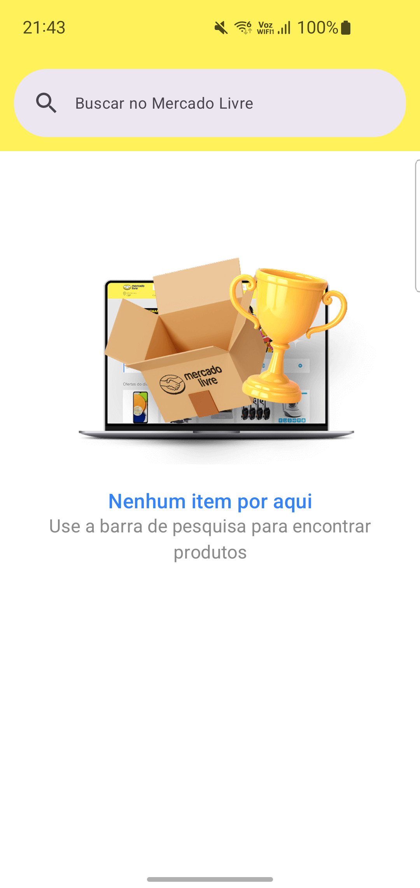
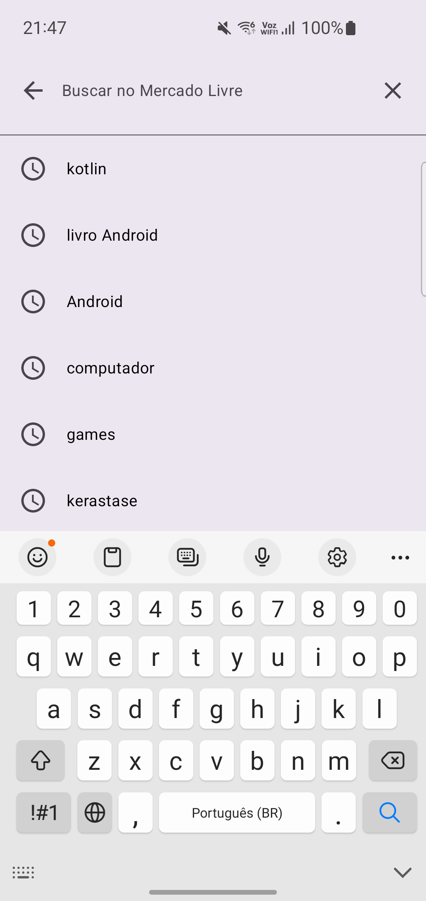

# Meli Android Search


Este projeto é uma aplicação Android desenvolvida como parte de um desafio técnico, que consome a API do Mercado Livre para permitir que os usuários pesquisem produtos, visualizem os resultados e vejam os detalhes de um item específico.

## 📸 Telas da Aplicação

|                      E-mail/Login                      |                      Password/Login                      |                           Token/Login                            |
|:------------------------------------------------------:|:--------------------------------------------------------:|:----------------------------------------------------------------:|
|  |  |  

|                         Code/Login                         |                          Home                           |                           Pesquisa                            |
|:----------------------------------------------------------:|:-------------------------------------------------------:|:----------------------------------------------------------------:|
|  |  |  

|                   Resultados da Pesquisa                    |                       Detalhes do Produto                      |                       Descrição do Produto                       |
|:---------------------------------------------:|:------------------------------------------------------------------:|:----------------------------------------------------------------:|
|  |  |  |

## ✨ Funcionalidades

* **Autenticação:** Autenticação do Mercado Livre para processo de Oauth2 Bearer Token.
* **Busca de Produtos:** Campo de pesquisa para encontrar itens na plataforma do Mercado Livre.
* **Listagem de Resultados:** Exibição dos resultados da busca em uma lista clara e objetiva.
* **Detalhes do Produto:** Visualização de informações detalhadas de um produto selecionado, incluindo imagens, preço e descrição.
* **Tratamento de Estado:** A aplicação mantém o estado em todas as telas, mesmo após a rotação do dispositivo.
* **Experiência do Usuário:** Interface fluida com feedback visual para carregamento, erros e estados vazios.

## 🛠️ Tecnologias Utilizadas

* **Linguagem:** [Kotlin 2](https://kotlinlang.org/)
* **Arquitetura:** MVVM (Model-View-ViewModel) com Clean Architecure pensando em escalabilidade de forma segura e eficiente.
* **Componentes de Arquitetura do Android (Jetpack):**
    * **Jetpack Compose:** Para implementação de UI de forma moderna e eficiente.
    * **ViewModel:** Para gerenciar dados relacionados à UI de forma consciente do ciclo de vida.
    * **StateFlow:** Para observar mudanças nos dados e atualizar a UI de forma reativa.
    * **Navigation Component:** Para gerenciar a navegação entre as telas do app.
* **Networking:**
    * **Ktor Client:** Para realizar chamadas de API Http.
* **Room:** Para persistência de dados em cache Local juntamente com SQLCipher para armazenamento seguro criptografado.
* **Injeção de Dependência:**
    * **Koin:** Para injeção de dependências.
* **Coroutines e Flow:** Para gerenciamento de operações assíncronas.
* **Carregamento de Imagens:**
    * **Glide:** Para carregar imagens da internet de forma eficiente.

## ⚙️ Configuração do Ambiente de Desenvolvimento

Para compilar e executar o projeto localmente, siga os passos abaixo.

### Pré-requisitos

* Android Studio Hedgehog ou superior.
* JDK 17.

### Passos

1.  **Clone o repositório:**
    ```bash
    git clone [https://github.com/GiovannaAmatucci/MeliAndroidSearch.git](https://github.com/GiovannaAmatucci/MeliAndroidSearch.git)
    cd MeliAndroidSearch
    ```

2.  **Crie suas credenciais da API do Mercado Livre:**
    * Acesse o portal de desenvolvedores do Mercado Livre: [https://developers.mercadolivre.com.br/devcenter/](https://developers.mercadolivre.com.br/devcenter/)
    * Crie uma nova aplicação para obter seu `client_id` e `client_secret`. Estas credenciais são necessárias para gerar o Bearer `ACCESS_TOKEN` para autenticar as requisições à API.

3.  **Configure suas chaves de API:**
    * Na raiz do projeto, crie um arquivo chamado `apikey.properties`.
    * Adicione suas credenciais ao arquivo no seguinte formato:
        ```properties
        CLIENT_ID="SEU_CLIENT_ID"
        CLIENT_SECRET="SEU_CLIENT_SECRET"
        ```
    * Substitua `"SEU_CLIENT_ID"` e `"SEU_CLIENT_SECRET"` pelas chaves que você gerou no portal do Mercado Livre.

4.  **Compile e execute o projeto:**
    * Abra o projeto no Android Studio.
    * O Gradle irá sincronizar e baixar as dependências necessárias.
    * Execute o aplicativo em um emulador ou dispositivo físico.

## 🚀 Deploy (CI/CD)

O processo de Integração Contínua (CI) está configurado através do GitHub Actions, utilizando o workflow definido em `.github/workflows/android-ci.yml`.

Este workflow é acionado automaticamente a cada `push` ou `pull request` direcionado à branch `master`. As principais etapas do processo são:

1.  **Checkout:** O código da branch é baixado para o ambiente de execução.
2.  **Setup JDK:** O ambiente é configurado com a versão 17 do Java.
3.  **Setup Gradle:** O cache do Gradle é configurado para acelerar os builds futuros.
4.  **Make gradlew executable:** A permissão de execução é concedida ao wrapper do Gradle.
5.  **Build with Gradle:** O projeto é compilado e os testes unitários são executados com o comando `./gradlew build`.

Este processo garante que novas alterações não quebrem a funcionalidade existente e que o projeto esteja sempre em um estado compilável, mantendo a qualidade e a integridade do código.
